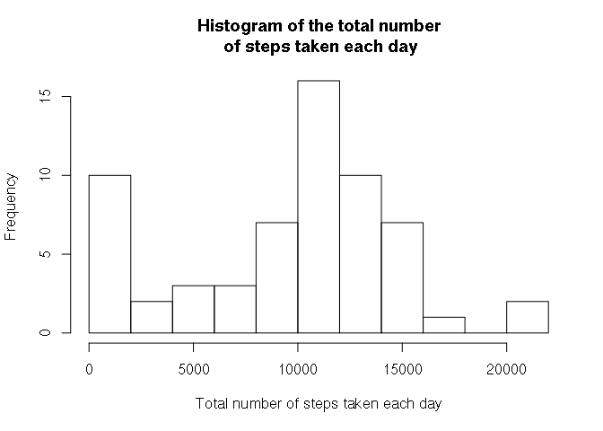
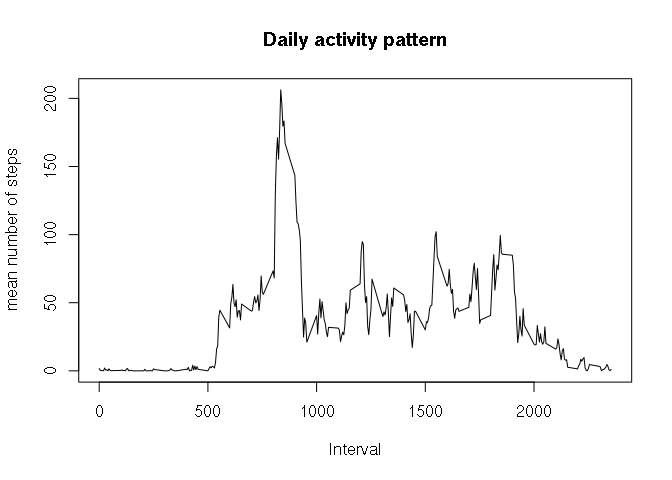
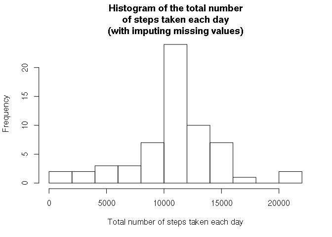
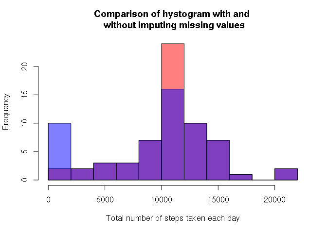
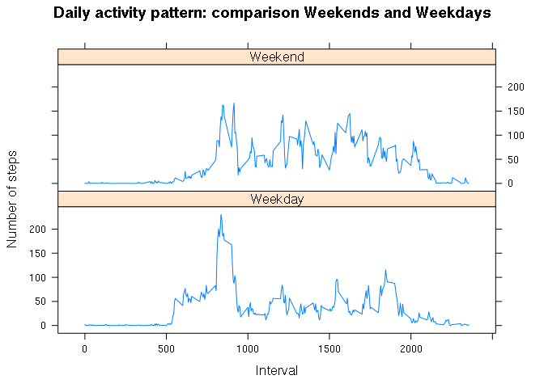

# Reproducible Research: Peer Assessment 1

This assignment makes use of data from a personal activity monitoring device. This device collects data at 5 minute intervals through out the day. The data consists of two months of data from an anonymous individual collected during the months of October and November, 2012 and include the number of steps taken in 5 minute intervals each day.

## Loading and preprocessing the data

As first thing I unzip the data and then I read the *activity monitoing data* assigning it at the variable **Amd**:


```r
unzip("activity.zip")
Amd <- read.csv("activity.csv")
```

Some information about this data set (name of the variables, the dimension of the data, a quick look at the content):

```r
names(Amd)
```

```
## [1] "steps"    "date"     "interval"
```

```r
dim(Amd)
```

```
## [1] 17568     3
```

```r
str(Amd)
```

```
## 'data.frame':	17568 obs. of  3 variables:
##  $ steps   : int  NA NA NA NA NA NA NA NA NA NA ...
##  $ date    : Factor w/ 61 levels "2012-10-01","2012-10-02",..: 1 1 1 1 1 1 1 1 1 1 ...
##  $ interval: int  0 5 10 15 20 25 30 35 40 45 ...
```

From here we see it is a good idea to convert the factor *date* in object of class Date:

```r
Amd$date <- as.Date(Amd$date)
```

## What is mean total number of steps taken per day?

To answer this question, using the library dplyr, I group before the data by date:

```r
library(dplyr)
AmdByDate <- group_by(Amd, date)
```

Now I can calculate the total number of steps taken each day:

```r
totalStepsPerDay <- summarise(AmdByDate, tot=sum(steps, na.rm = T))
```

With them I can make an histogram

```r
hist(totalStepsPerDay$tot, breaks = 10, xlab = "Total number of steps taken each day", main = " Histogram of the total number \n of steps taken each day")
```

<!-- -->

The media and the median are:

```r
mean(totalStepsPerDay$tot)
```

```
## [1] 9354.23
```

```r
median(totalStepsPerDay$tot)
```

```
## [1] 10395
```


## What is the average daily activity pattern?

First of all I group my data by interval:

```r
AmdByInterval<- group_by(Amd,interval)
```

Now I can calculate the mean of steps taken in each interval:

```r
avgStepsPerInterval <- summarise(AmdByInterval, avgSteps=mean(steps, na.rm = T))
```


From the previous data I can make a plot which show the mean number of steps vs interval:

```r
 plot(avgStepsPerInterval$interval, avgStepsPerInterval$avgSteps, type = "l", xlab = "Interval", ylab = "mean number of steps", main = "Daily activity pattern" )
```

<!-- -->


To calculate which 5-minute interval, on average across all the days 
in the dataset, contains the maximum number of steps, I determine before the maximum value: 


```r
maxAvg <- max(avgStepsPerInterval$avgSteps)
print(maxAvg)
```

```
## [1] 206.1698
```

and than the corresponding interval:

```r
avgStepsPerInterval[avgStepsPerInterval$avgSteps==maxAvg,1][[1]]
```

```
## [1] 835
```

## Imputing missing values


To calculate the total number of missing values in the dataset (i.e. the total number of rows with *NA*s) I check it by column:

```r
colSums(is.na(Amd))
```

```
##    steps     date interval 
##     2304        0        0
```

There are *NA* only in the column **step**.

I will fill the missing values considering the
mean of steps taken in each interval which I calculated before
(**avgStepsPerInterval**).

First of all, I merge the two data set by *interval*:

```r
Amd2 <- merge(Amd, avgStepsPerInterval, by = "interval")
```

Now I substiture the *NA* values in the column **steps** with
the mean of steps taken in each interval (which is store in **avgSteps**)


```r
NAIndex <-is.na(Amd2$steps)
Amd2$steps[NAIndex]<-Amd2$avgSteps[NAIndex]
```

Now I can reconstruct the data set:

```r
Amd2 <- select(Amd2, steps, date, interval)
Amd2<-arrange(Amd2, date)
```


I can now make again the histogram of the total number of steps taken each day:

```r
Amd2ByDate <- group_by(Amd2, date)
totalStepsPerDay2 <- summarise(Amd2ByDate, tot=sum(steps, na.rm = T))
hist(totalStepsPerDay2$tot, breaks = 10, xlab = "Total number of steps taken each day", main = " Histogram of the total number \n of steps taken each day \n (with imputing missing values) ")
```

<!-- -->

Again the mean and the median:

```r
mean(totalStepsPerDay2$tot)
```

```
## [1] 10766.19
```

```r
median(totalStepsPerDay2$tot)
```

```
## [1] 10766.19
```

Comparing this histogram and the values of mean and median, with
the ones without imputing missing values, we see they are different.
 In particular we see that in the first hystogram a lot of data were around zero; now those points are around the mean.


```r
hist(totalStepsPerDay2$tot, col=rgb(1,0,0,0.5) , breaks = 10, xlab = "Total number of steps taken each day", main = "Comparison of hystogram with and \n without imputing missing values")
hist(totalStepsPerDay$tot, col=rgb(0,0,1,0.5) , breaks = 10, add=T)
```

<!-- -->

## Are there differences in activity patterns between weekdays and weekends?

First I introduce a new variable which say if it is weekend or not:

```r
Amd2$dayOfTheWeek <- as.factor(weekdays(Amd2$date))
Amd2 <-mutate(Amd2, dayOfTheWeek=ifelse(dayOfTheWeek=="Sunday" | dayOfTheWeek=="Saturday", dayOfTheWeek<-"Weekend", dayOfTheWeek<-"Weekday"))
```


Now I aggregate the data, calculating the average number of steps,
according to the variables **interval** and **dayOfTheWeek**: 

```r
Amd2Aggregate <- aggregate(steps ~ interval + dayOfTheWeek, data=Amd2, mean)
```

Now I can plot the data by Weekday and Weekend:

```r
library(lattice)
xyplot(steps ~interval | dayOfTheWeek, data=Amd2Aggregate, layout=c(1,2), xlab = "Interval", ylab = "Number of steps", type="l", main="Daily activity pattern: comparison Weekends and Weekdays")
```

<!-- -->


